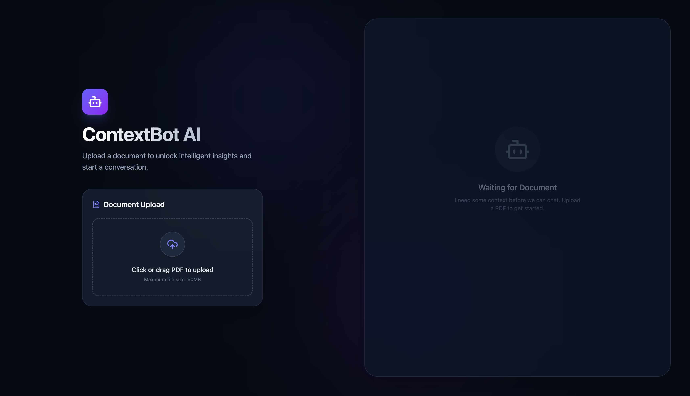
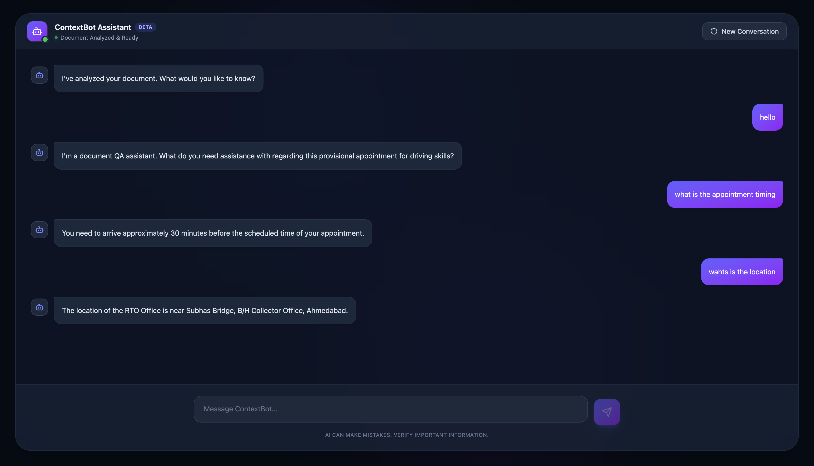
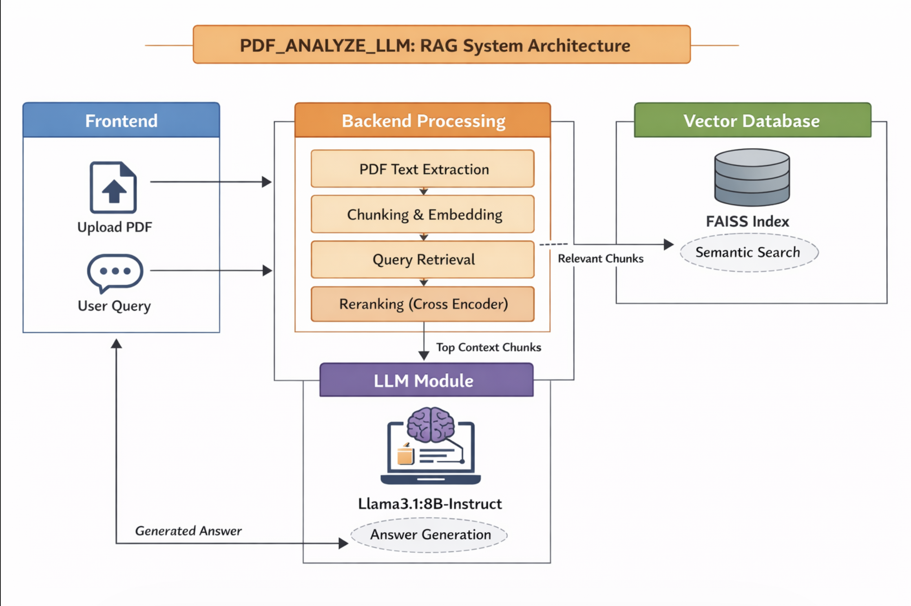

# 📄 PDF_ANALYZE_LLM

## 🚀 Overview

**PDF_ANALYZE_LLM** is a full-stack application designed to analyze PDF documents using **Retrieval-Augmented Generation (RAG)**.
It enables users to upload PDFs and interact with them through natural language queries, combining **semantic search** and **LLM-based generation** for accurate, context-aware responses.

---
## Interface




## 🧠 Architecture

# Diagram :-


The system follows a modular architecture:

* **Frontend** – Interactive UI for uploading PDFs and querying results
* **Backend** – Handles PDF processing, embeddings, and LLM inference
* **RAG Pipeline** – Combines retrieval + generation for accurate answers
* **Vector Database (FAISS)** – Stores embeddings for fast similarity search

---

## 🧩 Modules

### 🎨 Frontend

* **Tech Stack**: React, Vite, Axios
* **Features**:

  * Upload PDF documents
  * Ask questions about uploaded files
  * View results in a clean dashboard

---

### ⚙️ Backend

* **Tech Stack**: FastAPI, FAISS, SentenceTransformers
* **Responsibilities**:

  * PDF text extraction
  * Chunking & embedding
  * Vector search & reranking
  * LLM response generation

---

## 🔍 RAG Pipeline

The system uses a **Retrieval-Augmented Generation pipeline**:

### 1. Retrieval

* Text is split into chunks
* Embeddings generated using `BAAI/bge-small-en-v1.5`
* Stored in FAISS
* Relevant chunks retrieved via cosine similarity
* Re-ranked using CrossEncoder

### 2. Generation

* Top relevant chunks passed to LLM
* LLM generates accurate answers grounded in document context

---

## 🗄️ Vector Database

* Built using **FAISS**
* Uses **Inner Product similarity** (cosine with normalized embeddings)
* Supports fast semantic search across large documents

---

## 🤖 LLM Used

### `llama3.1:8b-instruct`

* Developed by Meta AI
* 8 billion parameters
* Optimized for instruction-following tasks
* Runs locally via Ollama

✅ Suitable for:

* RAG applications
* Document Q&A
* Local deployment

---

## 💻 Setup Instructions

### 1. Clone the Repository

```bash
git clone https://github.com/rahulthapa9024/PDF_ANALYZE_LLM.git
cd PDF_ANALYZE_LLM
```

---

### 2. Install Dependencies

#### Frontend

```bash
cd frontend
npm install
```

#### Backend

```bash
cd backend
pip install -r requirements.txt
```

---

### 3. Install and Run Ollama

Download Ollama:
👉 https://ollama.com/

Check installed models:

```bash
ollama list
```

Download model:

```bash
ollama pull llama3.1:8b
```

---

### 4. Start Services

#### Backend

```bash
uvicorn main:app --port 8000
```

#### Frontend

```bash
npm run dev
```

---

### 5. Open Application

👉 http://localhost:5173/

---

## 📡 API Endpoints

| Method | Endpoint               | Description             |
| ------ | ---------------------- | ----------------------- |
| POST   | `/upload-pdf/`         | Upload PDF              |
| GET    | `/pdf-status/{job_id}` | Check processing status |
| POST   | `/chat/`               | Ask questions about PDF |

---

## ⚡ Features

* 📄 PDF ingestion & processing
* 🔍 Semantic search with FAISS
* 🧠 Context-aware Q&A using RAG
* ⚡ Fast retrieval with reranking
* 💻 Fully local LLM support

---

## 🧠 Future Improvements

* Add citations (page numbers)
* Highlight relevant text in PDF
* Hybrid search (BM25 + semantic)
* Streaming responses
* Multi-document support

---

## 👨‍💻 Author

**Rahul Thapa**
